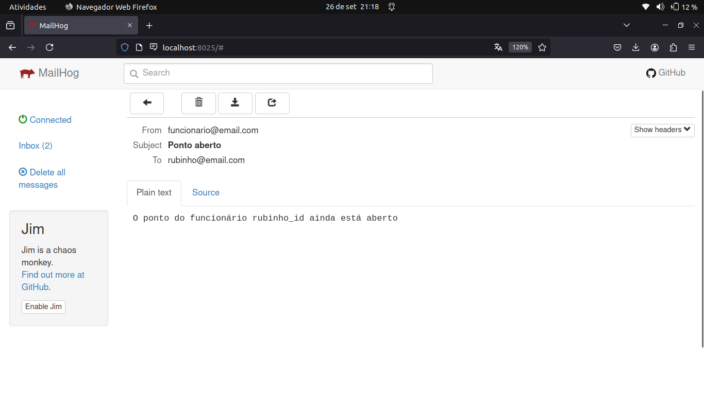

# Sending Events With Bulk Documentation

## Overview

This document provides an overview of the software and explains the available routes.

## Getting Started

To use this project, ensure you have Docker installed on your machine. Follow these steps:

1. Clone the repository to your local machine.
2. Navigate to the project directory.
3. Run the following command to start the application:

   ```sh
   docker-compose up
   ```

This will build and run the application using Docker Compose.

## Routes

### 1. `GET /pontos`

- **Description**: Retrieves a list of all pontos.
- **Response**:
  - `200 OK`: Returns an array of event objects.
  ```json
  [
    {
      "checkin": "2024-09-26T23:46:58.776Z",
      "checkout": null,
      "employeeId": "rubinho_id"
    },
    {
      "checkin": "2024-09-27T00:10:27.510Z",
      "checkout": "2024-09-27T00:10:34.237Z",
      "employeeId": "fernando_id"
    }
  ]
  ```
  - `500 Internal Server Error`: If there is an issue retrieving the events.

### 2. `POST /pontos`

- **Description**: Creates a new ponto and send a email to employee if ponto is not closed in 5 seconds.
- **Request Body**:
  ```json
  {
    "employeeId": "fernando_id"
  }
  ```
- **Response**:
  - `201 Created`: Returns the created event object.
  - `400 Bad Request`: If the employee already exists.

### 3. `GET /pontos/:employeeId`

- **Description**: Retrieves a specific ponto by ID.
- **Response**:
  - `200 OK`: Returns the ponto object.
  ```json
  {
    "checkin": "2024-09-27T00:10:27.510Z",
    "checkout": "2024-09-27T00:10:34.237Z",
    "employeeId": "fernando_id"
  }
  ```
  - `404 Not Found`: If the ponto with the specified ID does not exist.

### 4. `PATCH /pontos/:employeeId`

- **Description**: Close specified ponto by ID.
- **Response**:
  - `200 OK`: Returns the updated event object
  ```json
  {
    "message": "Ponto fechado para o funcionário employee_id",
    "ponto": {
      "checkin": "2024-09-27T00:10:27.510Z",
      "checkout": "2024-09-27T00:10:34.237Z",
      "employeeId": "fernando_id"
    }
  }
  ```
  - `400 Bad Request`: If the request body is invalid.
  - `404 Not Found`: If the event with the specified ID does not exist.

### 5. `DELETE /pontos`

- **Description**: Deletes all pontos.
- **Response**:
  - `204 No Content`: If the deletion is successful.

## Email Content

- **Description**: If ponto is not closed in 5 seconds an email is received.
- **Acess this url to view the email**: http://localhost:8025

  
